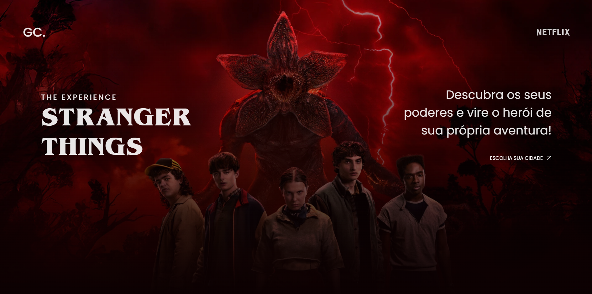
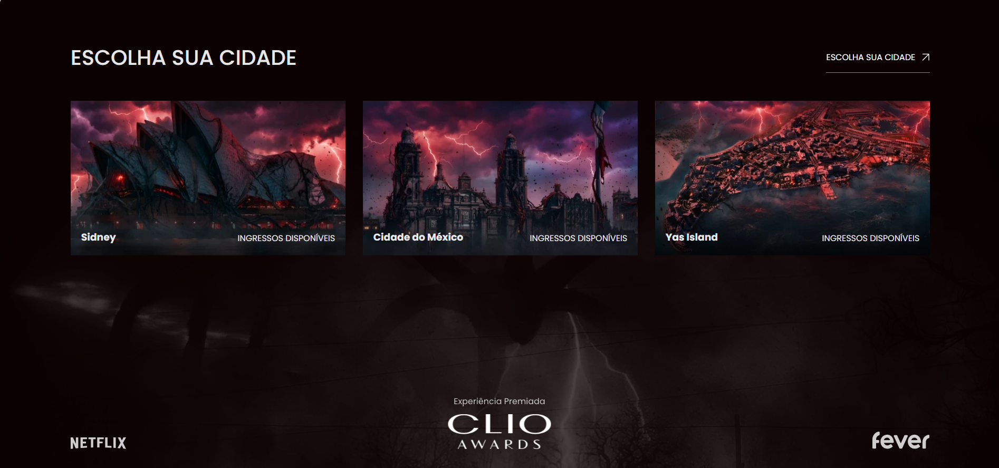
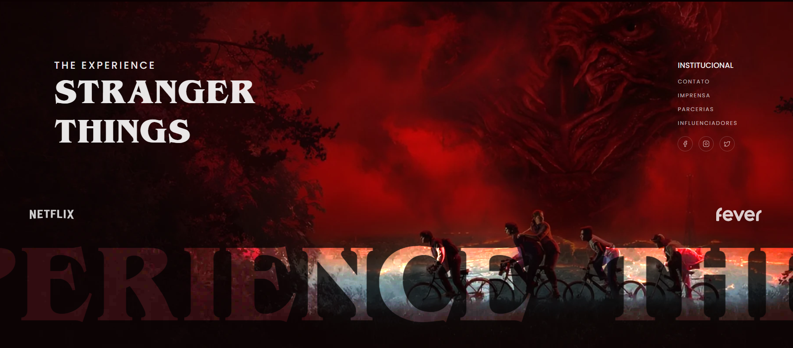

# Stranger Things Experience — Landing Page

> Landing page temática da **Stranger Things Experience**.
> Projeto construído ao vivo durante uma **semana de programação intensiva** focada em front-end, design e interações com GSAP.

---

## ✨ Destaques Visuais

### Hero


<br>

### Escolha sua Cidade


<br>

### Footer



---

## Sobre o Projeto

Esta landing page foi desenvolvida ao longo de uma **semana de programação intensiva ao vivo**, com foco em front-end, design de interação e efeitos com GSAP. O projeto foi construído do zero acompanhando as lives, cobrindo desde a estrutura HTML e estilização CSS até animações de scroll, SplitText de letras e efeito de parallax no hero.

O tema escolhido é a **Stranger Things Experience**, a experiência imersiva oficial da série. A landing page recria a identidade visual sombria e atmosférica da franquia, com tipografia customizada, fundo cinematográfico em camadas e animações orientadas ao scroll.

---

## Seções da Página

| # | Seção | Descrição |
|---|---|---|
| 01 | Hero | Apresentação com duas imagens em parallax, título com fonte Benguiat e botão CTA com scroll |
| 02 | Escolha sua Cidade | Cards das cidades disponíveis (Sidney, Cidade do México, Yas Island) com animação de blur |
| 03 | Depoimentos | Logos parceiros (Netflix, CLIO, Fever) e três citações da imprensa |
| 04 | Obrigado | Lista animada das cidades que sediaram o evento |
| 05 | Footer | Logo, redes sociais, links institucionais e carrossel tipográfico |

---

## Tecnologias

| Tecnologia | Função |
|---|---|
| HTML5 + CSS3 | Estrutura e estilização |
| [GSAP 3](https://gsap.com) | Animações de entrada, scroll e preloader |
| [ScrollTrigger](https://gsap.com/docs/v3/Plugins/ScrollTrigger/) | Gatilhos de animação baseados no scroll |
| [ScrollSmoother](https://gsap.com/docs/v3/Plugins/ScrollSmoother/) | Scroll suavizado com efeitos de parallax (GSAP Club) |
| [SplitText](https://gsap.com/docs/v3/Plugins/SplitText/) | Animação letra a letra nos títulos (GSAP Club) |
| Google Fonts | Poppins |
| Fonte customizada | Benguiat Bold — tipografia icônica da série |

> **Sobre os plugins GSAP Club:** ScrollSmoother e SplitText fazem parte do GSAP Club (licença paga).  
> Para uso comercial ou em produção, é necessária licença ativa em [gsap.com](https://gsap.com/pricing/).

---

## Como Rodar

```bash
# Sem instalação necessária — basta abrir no navegador:
open index.html

# Para desenvolvimento com live reload, recomenda-se:
# Extensão Live Server no VS Code
```

---

## Estrutura de Arquivos

```
stranger-things-experience/
├── index.html              → estrutura e conteúdo da página
├── style.css               → estilização e responsividade
├── script.js               → animações GSAP (preloader, scroll, SplitText)
├── fontes/
│   └── Benguiat Bold.ttf   → tipografia customizada da série
├── imagens/                → todas as imagens e ícones do projeto
└── docs/
    └── images/             → screenshots para este README
```

---

## Melhorias Implementadas

As seguintes melhorias foram adicionadas após a conclusão do projeto ao vivo:

- **Redes sociais como links de texto** — ícones substituídos por links clicáveis (Facebook, Instagram, X / Twitter) com `href` vazio para preenchimento futuro
- **Links institucionais clicáveis** — Contato, Imprensa, Parcerias e Influenciadores com `href` vazio para preenchimento futuro
- **Hover nos botões** — a seta desloca `8px` para a direita e o botão reduz opacidade com easing suave, sem conflitar com o visual já carregado da página
- **Botões funcionais sem bug** — scroll via `ScrollSmoother.get().scrollTo()`, eliminando o conflito com o scroll nativo que quebrava a página
- **Correção de typo** — "ESOLHA SUA CIDADE" corrigido para "ESCOLHA SUA CIDADE"

---

## Licença

Projeto educacional desenvolvido durante semana de programação ao vivo. Stranger Things é propriedade intelectual da Netflix. Uso exclusivo para fins de aprendizado e portfólio.

---

© 2026 · Jhonatan Pedro